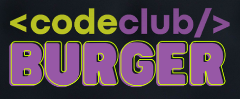

<h1 align="center">
    
</h1>

> ## 💻 Projeto
<p>CodeBurger é um sistema para lanchonete, que permite aos usuários se cadastrar, fazer pedidos e adicionar ao carrinho.</p>
<p>Tambem é possivel fazer login como adiministrador e ver os pedidos que foram realizados, ver a lista de produtos, adicionar e editar novos produtos.</p>
<p>Todos os usuários cadastrados, os produtos e os pedidos realizados, ficam gravados no banco de dados. Para ver a api <a href="https://github.com/W-Carlos/CodeBurger-api">clique aqui</a>.</p>

<!-- > ## 📸 Demo -->

> ## 🚀 Tecnologias
Esse projeto foi desenvolvido com as seguintes tecnologias:

* [React.js](https://pt-br.reactjs.org/)
* [Node.js](https://nodejs.org/en/)
* [React Hooks](https://pt-br.reactjs.org/docs/hooks-intro.html)
* [Styled-components](https://styled-components.com/)
* [Material UI](https://mui.com/pt/)
* [React Hook Form](https://react-hook-form.com/)
* [React-router-dom](https://v5.reactrouter.com/web/guides/quick-start)
* [React Toastify](https://fkhadra.github.io/react-toastify/introduction)
* [React Elastic Carousel](https://sag1v.github.io/react-elastic-carousel/)
* [Axios](https://www.npmjs.com/package/axios)
* [yarn](https://classic.yarnpkg.com/en/docs/install#windows-stable)
* [Yup](https://www.npmjs.com/package/yup)
* [Prettier](https://prettier.io/)
* [ESLint](https://eslint.org/)

>## Pré-requisitos

Antes de começar, você vai precisar ter instalado em sua máquina as seguintes ferramentas:
[Git](https://git-scm.com), [Node.js](https://nodejs.org/en/). 
Além disto é bom ter um editor para trabalhar com o código como [VSCode](https://code.visualstudio.com/)

### 🎲 Rodando a aplicação

```bash
# Clone este repositório
$ git clone <https://github.com/W-Carlos/code-burger.git>

# Acesse a pasta do projeto no terminal/cmd
$ cd code-burger

# Instale as dependências
$ yarn
# ou
$ npm install

# Execute a aplicação em modo de desenvolvimento
$ yarn start

# O servidor inciará na porta:3000 - acesse <http://localhost:3000> 

#A página será recarregada se você fizer edições.Você também verá quaisquer erros no console.
```

>## 📄 Licença
Este projeto está sob a licença MIT. Veja o arquivo <a href="https://github.com/W-Carlos/code-burger/blob/master/LICENSE.md">LICENSE</a> para mais detalhes.

---
<p align="center">Feito por Wend Carlos 👋</p>